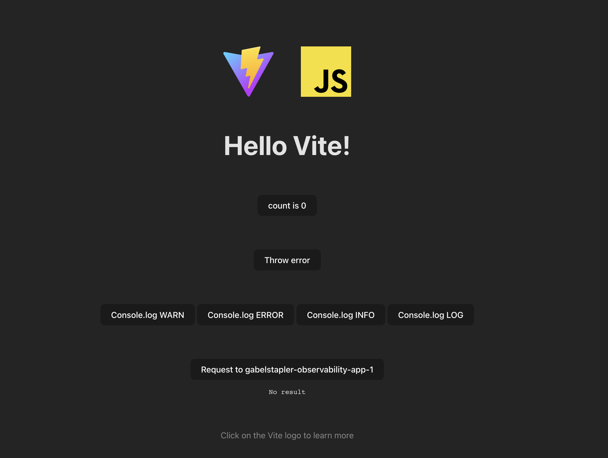
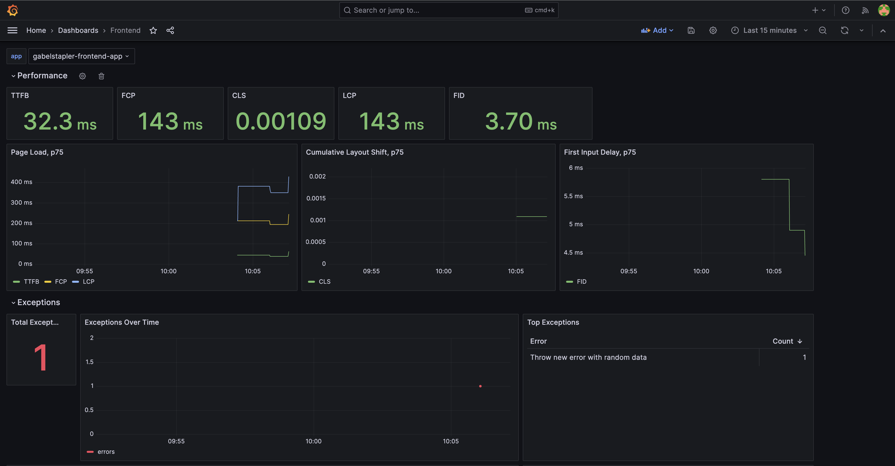
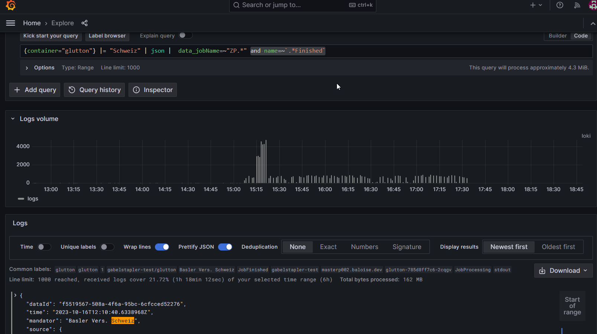
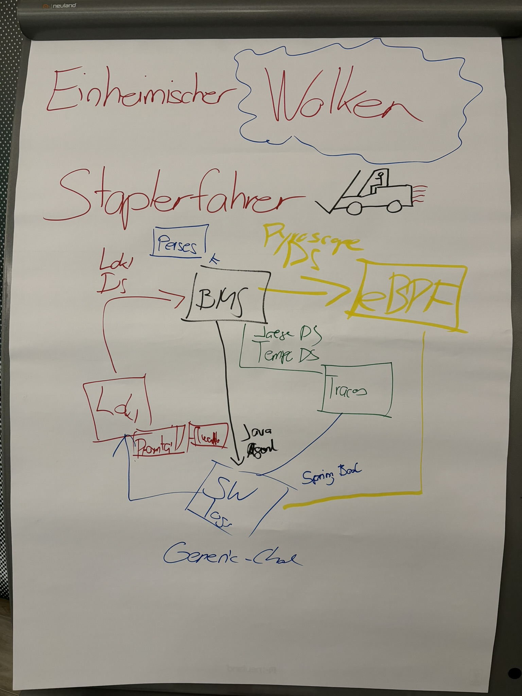

# Real user Monitoring

There aren't much OSS solutions available on the marked.  
One is [Boomerang](https://calendar.perfplanet.com/2018/open-source-backend-rum-tool-wait-what/)
which seams not like an out-of-the-box solution.

## Grafana Faro


### tl;dr

[Official docs](https://grafana.com/docs/grafana-cloud/monitor-applications/frontend-observability/?pg=oss-faro&plcmt=hero-btn-3)

* Real user monitoring (RUM) for frontend applications
* Reports metrics, logs and traces
* Requires installation of [Grafana Agent](https://grafana.com/docs/agent/latest/)
* A great start for RUM but still in it's early stages, specially regarding integration in other tools like tracing
  * Delivers the basics as you can see in the print screens but lacks compared to something like Dynatrace
  * Easy to setup for Baloise but client access security has to be clarified, specially for public clients

### Instrumentation

The [gabelstapler-frontend-app](https://github.com/baloise-incubator/gabelstapler-frontend-app) was used to test various
use cases.



The instrumentation if fairly easy with https://github.com/baloise-incubator/gabelstapler-frontend-app/blob/main/main.js#L24-L44.

You can find some default dashboards in `docs`.



# Profiling
## Pyroscope


### tl;dr

[Official docs](https://grafana.com/docs/pyroscope/latest/)

* Continuous profiling at scale
* Merge of Grafana Phlare and Pyroscope
  * Recently in 2023 so still movement and bugs
* Supports push and pull of profiles
* Backend
  * S3
  * GCS Object storage
  * Azure Blob Storage
* Frontend
  * Pyroscope UI
  * Grafana data source (in early stages)
* A great start for analysing CPU and memory but still early stage
  * Delivers the basics as you can see in the print screens but lacks compared to something like Dynatrace
  * Java is still in early stages and it's expected to enhance greatly in the future
  * Java only supports push
  * OTel tracing integration still lacking but basic linking would be here
  * Easy to setup for Baloise


[Java Flight Recorder integration](https://github.com/grafana/pyroscope/blob/main/docs/sources/configure-server/about-server-api.md#jfr-format)


* alloc_in_new_tlab_objects/bytes (inside TLAB)
* alloc_outside_tlab_objects/bytes (outside TLAB)
* cpu

### Instrumenting

The [gabelstapler-buggyapp](https://github.com/baloise-incubator/gabelstapler-buggyapp), was used to test various use cases.
The app exposes the following endpoints:
 * /example => normal fast request
 * /example/long => request with 15s sleep
 * /example/cpu => causing CPU spike for 15s
 * /example/memory => causing memory spike, > 2 GB

There are to [instrumentation](https://grafana.com/docs/pyroscope/latest/configure-client/language-sdks/java/) approaches:

* Auto
  * https://github.com/baloise-incubator/gabelstapler-buggyapp/blob/main/Dockerfile#L4-L5
* Manual
  * https://github.com/baloise-incubator/gabelstapler-buggyapp/blob/main/src/main/java/ch/baloise/observability/gabelstaplerbuggyapp/OtlpConfiguration.java

Additionally, the otel exporter has been enhanced with profiling information but this doesn't work yet.
https://github.com/baloise-incubator/gabelstapler-buggyapp/blob/main/src/main/java/ch/baloise/observability/gabelstaplerbuggyapp/OtlpConfiguration.java#L60-L67

### Example


[Pyroscope UI](https://pyroscope-monitoring-stack.apps.baloise.dev/?query=process_cpu%3Acpu%3Ananoseconds%3Acpu%3Ananoseconds%7Bservice_name%3D%22gabelstrapler-buggs-app%22%7D)

```
process_cpu:cpu:nanoseconds:cpu:nanoseconds{service_name="gabelstrapler-buggs-app"}
```
[Grafana UI](https://grafana-monitoring-stack.apps.baloise.dev/explore?panes=%7B%22uci%22:%7B%22datasource%22:%22PAF2BCAF32F82481F%22,%22queries%22:%5B%7B%22groupBy%22:%5B%5D,%22labelSelector%22:%22%7Bservice_name%3D%5C%22gabelstrapler-buggs-app%5C%22%7D%22,%22queryType%22:%22both%22,%22refId%22:%22A%22,%22datasource%22:%7B%22type%22:%22grafana-pyroscope-datasource%22,%22uid%22:%22PAF2BCAF32F82481F%22%7D,%22profileTypeId%22:%22memory:alloc_in_new_tlab_bytes:bytes::%22%7D%5D,%22range%22:%7B%22from%22:%221697779632461%22,%22to%22:%221697780736886%22%7D%7D%7D&schemaVersion=1&orgId=1)

```
{service_name="gabelstrapler-buggs-app"}
```


# Logging


## Loki

### Die (Heart-)Beat-Logs von Streamworks mittels Loki auf Grafana darstellen

Ziel ist es, dass wir eine Matrix oder ein Feld haben, wo den Status von einem Stream gem. Beat-Log ausgiebt.
Das setzt voraus, dass im Log der Wert "StartPoint" und der "EndPoint" auf completed steht.

StartPoint	->	Nicht vorhanden		= Stream nicht angelaufen (Grau)

StartPoint	->	Completed		= Stream Running (Gelb)

EndPoint	->	Nicht vorhanden		= Stream Running (Gelb)

EndPoint	->	Completed		= Stream Completed (Grün)

Beim Auslesen der Beats Logdaten ist uns aufgefallen, dass das komplette Beat-Log unhandlich ist.
Es gibt Zeilen, welche alte Laufdaten bereinigen oder logische Resourcen zuweisen oder entfernen.
Diese Informationen, welche ebenfalls auf dem StartPoint liegen, verkompliziert die Auswertung.
Die daraus resultierenden doppelte Einträge waren der Leserlichkeit und und unserem Goal ein Hinderniss
Um das Query in Grafana handlicher zu halten, wäre es besser, wenn wir auf Streamworks die Beat-Auswertung reduzieren würden. Es müssen nicht alle Events gelogt werden. 

In der Promtail Definition musste der Wert zum Einlesen der Logs von "tail" auf "cat" gesetzt werden.
Das Beat-Log wird pro Tag kontinuierlich befüllt. Wieviele Logs kann Loki einlesen bevor es zu Performanceeinbussen kommt?

Das Query um den Status der *Point (data_jobName) auszulisten konnte von Patrick erstellt werden.
Leider hatten wir nicht die Zeit um die Auswertung in einer übersichtlichen Matrix darstellen zu können.
Eine Query über dem Status der einzelnen Jobs über data_returnCode und data_jobName konnten wir zeitlich nicht erstellen.


### tl;dr
Loki's streght lies in the flawless integration in the Baloise monitoring stack by adding the capability to correlate metrics and logfile entries as well as integrating in the "Grafana Eco System".
Loki can be seeen as a valable substitution to Splunk, concerning logfile monitoring of application running on OpenShift.
A coexsistence of Splunk and Loki is envisionable.

* Loki delivers on it's promises
  * It's simple to setup
  * We could replace Splunk
    * Query language seams mighty enough
    * Tooling (e.g. forwarder) and integration (e.g. log formats) is stable and has a lot of possibilities
    * Would be bigger migration from Splunk because of alerts, dashboards. Tooling and setup migration would be rather easy
  * It's memory and storage efficient
  
### Installation:
  
  * using https://github.com/grafana/helm-charts/tree/main/charts/loki-distributed
  * set podSecurtityContext & containersecurtityContex on all "components" (loki, gateway,ingester,querier)
    for ingester & querier  "fsGroup: 1001050000" would be enough ( migth ommit extraVolumes then) --> could not be tested due to dependencies
  * used Minio ( https://grafana.com/docs/loki/latest/storage/) as storage.
  
## Promtail

### Installation:

  * using https://github.com/grafana/helm-charts/tree/main/charts/promtail.
  * create Service Account, ClusterRole & ClusterRoleBinding manually ( set promtail.rbac.create: false ).
  * create Cluster SecurityContextConstraints
    *  include "configMap" in volumes
    *  set priority > 0 to ensure the definitions to be used by promtail
  * set podSecurtityContext & containersecurtityContex

## Findings

  * Tenancy capability https://itnext.io/multi-tenancy-with-loki-promtail-and-grafana-demystified-e93a2a314473
      * implies the use of a dedicated label (e.g.: tenant_id) on promtail side usomg pipelines. Actually using a label on all "senders" to Loki should be best practice.
	  * for grafana there will be a Loki-datasource per tenant_id
	  
  * Data can be viewed by using LogQL (see https://grafana.com/docs/loki/latest/query/log_queries/) which is very close /similar to PromQL and shares a lot of syntax and functions.
   Parsing of the logdata can be challaging but LogQL offers a few good parsing functioons

  * For efficency, setting usefull labels is key ( tenantid, cluster, source, app or "Busines service", environment ...)
  
  * Uses scrape configs to get data in combination with ServiceDiscovery --> simple setup similar to prometheus servicediscovery (get definitons from Kubernetes , enhance with MetaData ... )
 
  * Input/Output to storage seems to be very effective/efficient concerning compressing and reading. 
  
  * multiple and simple ways to push data.

  * Integration with Grafana is flawless by adding a Loki Datastore. 
    Data can then also be viewed with the explorer see screenshot:
     	


# Tracing


## Opentelemetry collector / Jaeger
### tl;dr

#### Setup:


#### Tempo vs Open Telemetry collector / jaeger collector

* backend
  * Jaeger
    * ElasticSearch
    * Cassandra
    * (kafka) as cache
  * Grafana Tempo
    * AWS S3
    * GCS Object storage
    * Azure Blob Storage
* Frontend
  * Tempo
    * Grafana data source
  * Jaeger
    * Jaeger
    * Grafana data source

Verdict

* Setup of Tempo is simpler, no elasticsearch required
* Tempo seems to be better integrated in Grafana compared to Jeager but there isn't a huge gap
* We would recommend to use Open Telemetry setup with otel collector and Jeager, as for now (object storage limitations and already existing know-how)
* Both implement almost the same standard (e.g. endpoints, integration)

### Instrumenting

The [gablestapler-observability-app](https://github.com/baloise-incubator/gablestapler-observability-app) was used to test
various use cases.

The app is deployed multiple times and executes a call sequence.

To enable gRPC you have to do the following [instruction](https://github.com/baloise-incubator/gablestapler-observability-app/blob/main/src/main/java/ch/baloise/observability/gabelstaplerobservabilityapp/OtlpConfiguration.java).


### Exemplars

[Exemplars](https://grafana.com/docs/grafana/latest/fundamentals/exemplars/):
* metric / trace correlation basically for free
* cardinality issues
  * part of OpenMetrics standard
  * adds trace_id to exposed request metrics
  * each scrape get last trace_id
* LTS (long term storage)
  * exemplars are stored in-memory [https://prometheus.io/docs/prometheus/latest/feature_flags/#:~:text=Exemplar%20storage%20is%20implemented%20as,circular%20buffer%20by%20%23%20of%20exemplars](https://prometheus.io/docs/prometheus/latest/feature_flags/#exemplars-storage)
* use-case might be very limited


#### example

* Enable Exemplars on Prometheus side
```
extraArgs:
  enable-feature: exemplar-storage
```
* configure tempo/jaeger datasource
* Instrument app with prometheus client library
* Select request metrics

```promql
histogram_quantile(0.95, sum(rate(http_server_requests_seconds_bucket[5m]))by (le, pod))
```


# Alternative to Grafana dashboards


## perses
<https://github.com/perses/perses>

> Perses is part of the CoreDash community. It belongs to the Linux Foundation. At a later stage, we want to promote the project to the Cloud Native Computing Foundation and be part of the monitoring tools like Prometheus or Thanos.

> ... Perses is still in an early alpha stage ...

* dashboard engine with in mind GitOps
  * dashboards, datasources, ... as code
  * currently just compatible with Prometheus
  * migration toolkit to convert dashboards from Grafana to Perses
  * panel types:
    * Time series charts.
    * Gauge panels.
    * Stat panels (single value with sparkline).
    * Markdown panels (as an alternative to the Text panel)

# Flipchart drawing



# Deploy monitoring-stack (hacky manual steps)

* Deploy Prometheus operator in namespace using OLM
* Generate prometheus-htpasswd secret
* Generate thanos-querier-htpasswd secret
* Generate thanos-ruler-htpasswd secret
* Generate cookie-session-secret secret
* Create external-exporters secret with key external-exporters.yaml
* Create node-exporter-generic secret
* Update uid/gid to match newly created namespace or create SCCs
* Deploy resources in hack/ directory
* Create MinIO buckets `chunks` and `grafana-pyroscope-data`
* Create MinIO service account and allow access to buckets

# On call

http://monitoring-stack-oncall-engine:8080

X-Forwarded-User: dweber019
