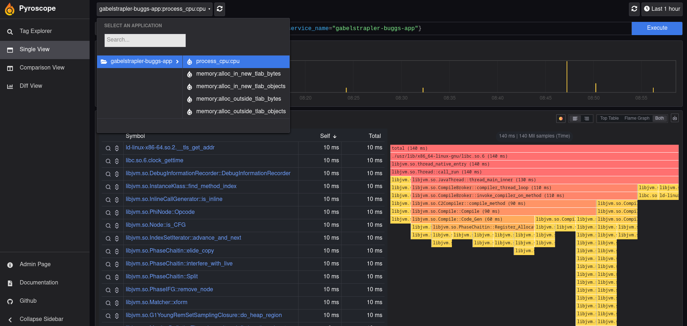
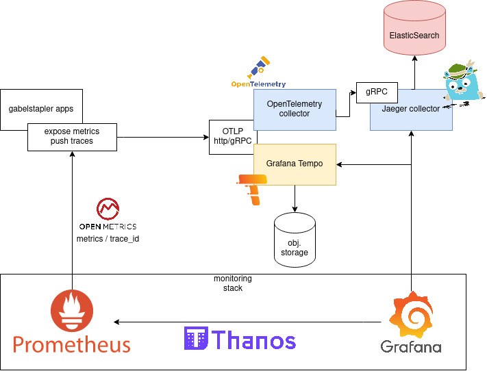
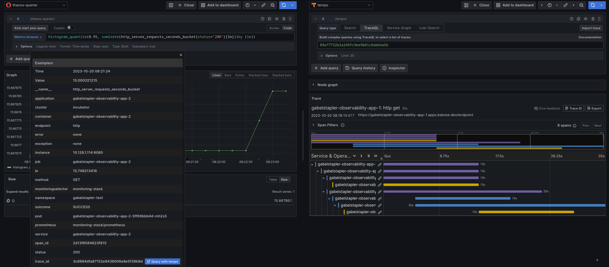
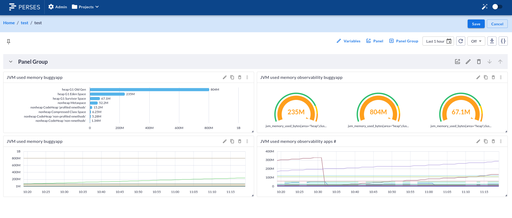

# Real user Monitoring
## Grafana Faro


### tl;dr

# Profiling
## Pyroscope


### tl;dr
* continuous profiling at scale
* Merge of Grafana Phlare and Pyroscope
* supports push and pull of profiles
* backend
  * S3
  * GCS Object storage
  * Azure Blob Storage
* frontend
  * Pyroscope UI
  * Grafana data source (in early stages)


[Java Flight Recorder integration](https://github.com/grafana/pyroscope/blob/main/docs/sources/configure-server/about-server-api.md#jfr-format)


* alloc_in_new_tlab_objects/bytes (inside TLAB)
* alloc_outside_tlab_objects/bytes (outside TLAB)
* cpu

### Example



[Pyroscope UI](https://pyroscope-monitoring-stack.apps.baloise.dev/?query=process_cpu%3Acpu%3Ananoseconds%3Acpu%3Ananoseconds%7Bservice_name%3D%22gabelstrapler-buggs-app%22%7D)

```
process_cpu:cpu:nanoseconds:cpu:nanoseconds{service_name="gabelstrapler-buggs-app"}
```
[Grafana UI](https://grafana-monitoring-stack.apps.baloise.dev/explore?panes=%7B%22uci%22:%7B%22datasource%22:%22PAF2BCAF32F82481F%22,%22queries%22:%5B%7B%22groupBy%22:%5B%5D,%22labelSelector%22:%22%7Bservice_name%3D%5C%22gabelstrapler-buggs-app%5C%22%7D%22,%22queryType%22:%22both%22,%22refId%22:%22A%22,%22datasource%22:%7B%22type%22:%22grafana-pyroscope-datasource%22,%22uid%22:%22PAF2BCAF32F82481F%22%7D,%22profileTypeId%22:%22memory:alloc_in_new_tlab_bytes:bytes::%22%7D%5D,%22range%22:%7B%22from%22:%221697779632461%22,%22to%22:%221697780736886%22%7D%7D%7D&schemaVersion=1&orgId=1)

```
{service_name="gabelstrapler-buggs-app"}
```


# Logging


## Loki
### tl;dr


# Tracing


## Opentelemetry collector / Jaeger
### tl;dr

#### Setup:



#### Tempo vs otel collector / jaeger

* backend
  * Jaeger
    * ElasticSearch
    * Cassandra
    * kafka
  * Grafana Tempo
    * S3
    * GCS Object storage
    * Azure Blob Storage
* frontend
  * Grafana Tempo
    * Grafana
  * Jaeger
    * Jaeger
    * Grafana

### Exemplars

[Exemplars](https://grafana.com/docs/grafana/latest/fundamentals/exemplars/):
* metric / trace correlation
* cardinality issues
  * part of OpenMetrics standard
  * adds trace_id to exposed request metrics
  * each scrape get last trace_id
* LTS
  * exemplars are stored in-memory
  * increase buffe size can increase retention - will be short-lived

#### example

* Enable Exemplars on Prometheus side
```
extraArgs:
  enable-feature: exemplar-storage
```
* configure tempo/jaeger datasource
* Instrument app with prometheus client library
* Select request metrics

```promql
histogram_quantile(0.95, sum(rate(http_server_requests_seconds_bucket[5m]))by (le))
```




# Alternative to Grafana dashboards



## perses
<https://github.com/perses/perses>

> Perses is part of the CoreDash community. It belongs to the Linux Foundation. At a later stage, we want to promote the project to the Cloud Native Computing Foundation and be part of the monitoring tools like Prometheus or Thanos.

> ... Perses is still in an early alpha stage ...

* dashboard engine with in mind GitOps
  * dashboards, datasources, ... as code
  * currently just compatible with Prometheus
  * migration toolkit to convert dashboards from Grafana to Perses
  * panel types:
    * Time series charts.
    * Gauge panels.
    * Stat panels (single value with sparkline).
    * Markdown panels (as an alternative to the Text panel)

